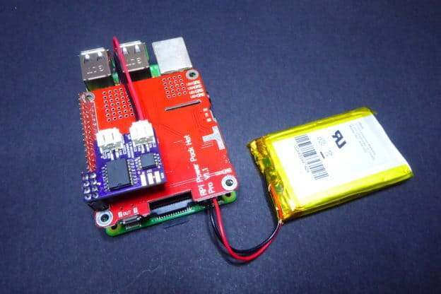
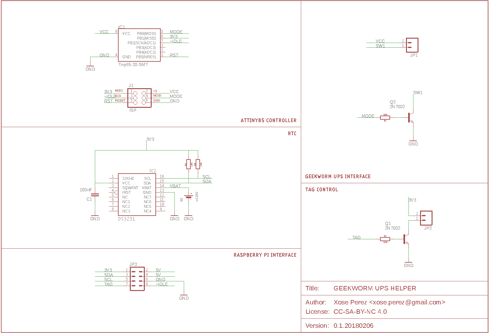
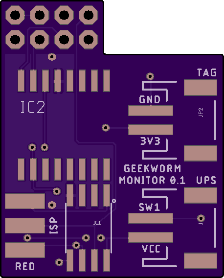
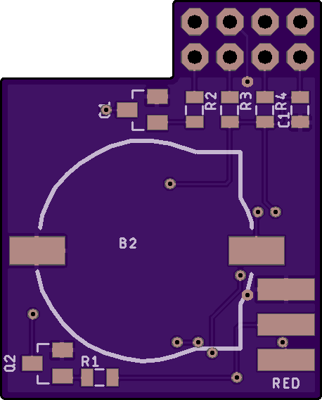

# GeekWorm UPS Helper

This repository contains the PCB design for an addon board for the Raspberry Pi + GeekWorm UPS Hat.

Check my blog post about this project to know more: http://tinkerman.cat/geekworm-power-pack-hat-hack/

## License

The PCB design and layout is licensed under CC-SA-BY-NC-4.0 International.
